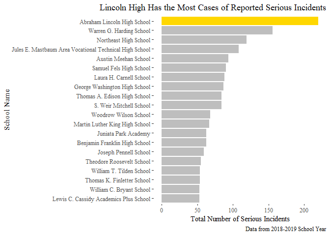

Philadelphia Schools Serious Incidents Part 2: Schools with the Most
Incidents
================
Jin Chen
7/27/2020

# Purpose

**Potential questions generated at the end of Part 1. I will answer
question \#3 in this section.**

1.Are there any trends of SDP serious incidents by type? For example,
has “Disorderly Conduct” always been the vast majority of incidents?

2.Has serious incidents been increasing or decreasing in SDP schools?

**3.Do some schools have more reported incidents than others?**

4.How have some schools performed historically in serious incidents? For
example, have some schools been decreasing and others increasing?

5.Is there any correlation between number of serious incidents and other
factors such as attendance and graduation rates?

# Content

I load the same data used in Part 1.

I will also only be working with the 2018-2019 data for both serious
incidents and school ID matchings.

``` r
#R Studio API Code
#library(rstudioapi)
#setwd(dirname(rstudioapi::getActiveDocumentContext()$path))

library(tidyverse)
library(readxl)
library(ggthemes)

url <- "https://cdn.philasd.org/offices/performance/Open_Data/School_Performance/Serious_Incidents/School%20Profiles%20Serious%20Incidents%202018-2019.xlsx"
destfile <- "../data/SY18-19.xlsx"
download.file(url, destfile, mode = "wb")

incidents_df <- read_excel(destfile, sheet = 1)
school_info_df <- read.csv("https://cdn.philasd.org/offices/performance/Open_Data/School_Information/School_List/2018-2019%20Master%20School%20List%20(20190510).csv")
```

``` r
school_info_df$SRC.School.ID <- as.numeric(as.character(school_info_df$SRC.School.ID))
```

    ## Warning: NAs introduced by coercion

``` r
incidents_joined_df <- incidents_df %>% 
  left_join(school_info_df, by = c("SCHOOL_ID" = "SRC.School.ID" )) %>% 
  select(SCHOOL_ID, INCIDENT_TYPE, INCIDENT_COUNT, Publication.Name)

incidents_grouped_df <- incidents_joined_df %>% 
  group_by(Publication.Name) %>% 
  summarize(Total = sum(INCIDENT_COUNT)) %>% 
  arrange(desc(Total))
```

    ## `summarise()` ungrouping output (override with `.groups` argument)

So we grouped the two tables and now we can see which schools have the
most incidents. We see that Abraham Lincoln High School is
overwhelmingly at the top with a reported 220 incidents. I wonder why
that is?

What I have realized is that the top 10 schools do not distinguish
between high school, middle school, etc. Thus we can separate it out
further. Also, we don’t know of the total count of incidents, what
incidents make up that count. We can use the incidents\_joined\_df for
this purpose. But for now, lets work with the incidents\_grouped\_df.

Lets do a quick visualization of what we have. First, we create a new
column that distinguishes Lincoln High from the other schools. This will
come in handy to highlight the fact that Lincoln has the most incidents.

# Structure and Formatting

``` r
incidents_grouped_df <- incidents_grouped_df %>% 
  mutate(School = 
           ifelse(Publication.Name == "Abraham Lincoln High School",
                  "Lincoln High",
                  "Other Schools"))


incidents_grouped_df %>% 
  slice(1:20) %>% 
  mutate(Publication.Name = fct_reorder(Publication.Name, Total)) %>% 
  ggplot(., mapping = aes(x = Publication.Name, y = Total)) +
  geom_col(aes(fill = School)) +
  coord_flip() +
  theme_tufte() +
  labs(title = "Lincoln High Has the Most Cases of Reported Serious Incidents",
       x = "School Name",
       y = "Total Number of Serious Incidents",
       caption = "Data from 2018-2019 School Year") +
  theme(legend.position = "none") +
  theme(plot.title = element_text(hjust = 1)) +
  scale_fill_manual(values = c("gold", "grey"))
```

<!-- -->

We show only the top 20 schools with the most incidents and color
Lincoln’s bar gold for its school colors (black and gold). Thus ends
this visualization with the purpose of answering the question “Do some
schools have more reported incidents than others?”.

We see that the 4 schools with the most incidents have over 100 reported
incidents. Furthermore, Harding and Lincoln have visibily more incidents
than the rest.

# **Potential Future Questions**

1.  Lets dig deeper into Lincoln High’s historical numbers. What are the
    historical trends?

2.  I can look at the numbers statistically. What are the mean and
    median incidents for all schools? for middle schools? for high
    schools?

3.  The dataset provides GPS location data for all schools. Is there any
    relationship between location and serious incidents? (I recognize
    many of these schools in the Northeast as I grew up there - NE,
    Lincoln, Fels, GW High, Wilson middle)

4.  If I want to add further data, I can bring in educational data. This
    can include attendance rates, graduation rates, SAT scores, ACT
    scores, and PSSA scores. Is there any relationship between number of
    incidents and educational attainment?

5.  It would be useful to facet by type of school (middle, high) and
    look at that data separately. It does seem a bit concerning that
    Harding middle school has more incidents than Northeast High.
